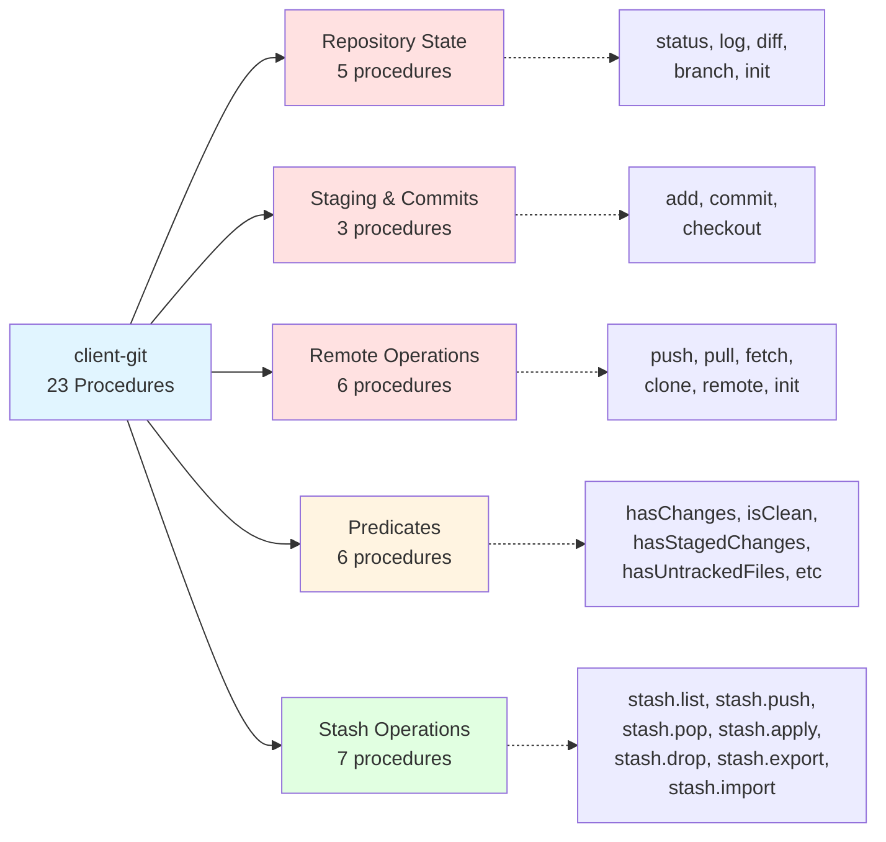

# @mark1russell7/client-git

[](https://www.npmjs.com/package/@mark1russell7/client-git)
[](https://opensource.org/licenses/MIT)

> Git operations as RPC procedures - `git.add`, `git.commit`, `git.push`, `git.status`, and 19 more git commands exposed as type-safe procedures.

## Overview

`@mark1russell7/client-git` exposes comprehensive Git functionality as RPC procedures through the client system. It provides 23 procedures covering all major Git operations including repository state management, staging, commits, branching, remote operations, stashing, and repository predicates.

This package wraps Git commands directly (not through `client-shell`), providing structured input/output with full type safety via Zod schemas.

## Architecture

```mermaid
graph TB
    A[client-git] -->|depends on| B[@mark1russell7/client]
    A -->|validates with| C[zod]

    D[Application] -->|calls| E[git.* procedures]
    E -->|executes| F[Git CLI]
    E -->|parses| G[Structured Output]

    H[Repository State<br/>status, log, diff, branch] -.-> E
    I[Staging & Commits<br/>add, commit, checkout] -.-> E
    J[Remote Sync<br/>push, pull, fetch, clone] -.-> E
    K[Stash Operations<br/>stash.*, export, import] -.-> E
    L[Predicates<br/>hasChanges, isClean, etc] -.-> E

    style A fill:#e1f5ff
    style E fill:#e1ffe1
```

### Procedure Categories



## Installation

```bash
# Using pnpm (recommended)
pnpm add @mark1russell7/client-git

# Using npm
npm install @mark1russell7/client-git

# Using yarn
yarn add @mark1russell7/client-git
```

## Quick Start

```typescript
import { Client } from "@mark1russell7/client";
import "@mark1russell7/client-git/register.js";

const client = new Client();

// Get repository status
const status = await client.call(["git", "status"], {
  cwd: "/path/to/repo",
});
console.log(status.branch, status.files);

// Stage and commit
await client.call(["git", "add"], { all: true });
await client.call(["git", "commit"], { message: "feat: add new feature" });

// Push to remote
await client.call(["git", "push"], { remote: "origin" });
```

## API Reference

### Repository State Procedures

#### `git.status`

Get current repository status including branch, tracking info, and file changes.

**Path:** `["git", "status"]`

```typescript
interface GitStatusInput {
  /** Working directory (default: process.cwd()) */
  cwd?: string;
  /** Show short format (default: false) */
  short?: boolean;
}

interface GitStatusFile {
  path: string;
  status: "modified" | "added" | "deleted" | "renamed" | "copied" | "untracked" | "ignored";
  staged: boolean;
}

interface GitStatusOutput {
  branch: string;
  ahead: number;
  behind: number;
  files: GitStatusFile[];
  clean: boolean;
}
```

**Example:**
```typescript
const status = await client.call(["git", "status"], { cwd: "./my-repo" });
console.log(`On branch ${status.branch}`);
console.log(`${status.ahead} commits ahead, ${status.behind} behind`);
console.log(`${status.files.length} changed files`);
```

#### `git.log`

Show commit history.

**Path:** `["git", "log"]`

```typescript
interface GitLogInput {
  /** Number of commits to show (default: 10) */
  count?: number;
  /** One line per commit (default: false) */
  oneline?: boolean;
  /** Branch/tag/commit to start from (default: HEAD) */
  ref?: string;
  /** Working directory */
  cwd?: string;
}

interface GitLogCommit {
  hash: string;
  shortHash: string;
  author: string;
  email: string;
  date: string;
  message: string;
}

interface GitLogOutput {
  commits: GitLogCommit[];
}
```

**Example:**
```typescript
const log = await client.call(["git", "log"], { count: 5 });
for (const commit of log.commits) {
  console.log(`${commit.shortHash} - ${commit.message}`);
}
```

#### `git.diff`

Show changes between commits, branches, or working directory.

**Path:** `["git", "diff"]`

```typescript
interface GitDiffInput {
  /** Show staged changes (default: false, shows unstaged) */
  staged?: boolean;
  /** Compare against ref (branch/commit) */
  ref?: string;
  /** Specific paths to diff */
  paths?: string[];
  /** Show stat summary only (default: false) */
  stat?: boolean;
  /** Working directory */
  cwd?: string;
}

interface GitDiffFile {
  path: string;
  additions: number;
  deletions: number;
}

interface GitDiffOutput {
  files: GitDiffFile[];
  additions: number;
  deletions: number;
  diff?: string;
}
```

**Example:**
```typescript
// Show unstaged changes
const diff = await client.call(["git", "diff"], { stat: true });
console.log(`${diff.additions} additions, ${diff.deletions} deletions`);

// Show staged changes
const staged = await client.call(["git", "diff"], { staged: true });
```

#### `git.branch`

Branch operations - list, create, delete branches.

**Path:** `["git", "branch"]`

```typescript
interface GitBranchInput {
  /** Branch name (for create/delete) */
  name?: string;
  /** Delete the branch (default: false) */
  delete?: boolean;
  /** List branches (default: true if no name provided) */
  list?: boolean;
  /** Include remote branches in list (default: false) */
  remote?: boolean;
  /** Working directory */
  cwd?: string;
}

interface GitBranchInfo {
  name: string;
  current: boolean;
  remote: boolean;
  tracking?: string;
}

interface GitBranchOutput {
  branches?: GitBranchInfo[];
  created?: string;
  deleted?: string;
  current: string;
}
```

**Example:**
```typescript
// List all branches
const branches = await client.call(["git", "branch"], { list: true });
console.log("Branches:", branches.branches.map(b => b.name));

// Create new branch
await client.call(["git", "branch"], { name: "feature/new-feature" });

// Delete branch
await client.call(["git", "branch"], { name: "old-feature", delete: true });
```

#### `git.init`

Initialize a new git repository.

**Path:** `["git", "init"]`

```typescript
interface GitInitInput {
  /** Directory to initialize (default: process.cwd()) */
  cwd?: string;
  /** Create a bare repository (default: false) */
  bare?: boolean;
  /** Name for the initial branch */
  initialBranch?: string;
}

interface GitInitOutput {
  /** The initialized repository path */
  path: string;
  /** Whether the repo was newly created */
  created: boolean;
}
```

### Staging & Commit Procedures

#### `git.add`

Stage files for commit.

**Path:** `["git", "add"]`

```typescript
interface GitAddInput {
  /** Paths to stage (default: []) */
  paths?: string[];
  /** Stage all changes (default: false) */
  all?: boolean;
  /** Working directory */
  cwd?: string;
}

interface GitAddOutput {
  staged: string[];
}
```

**Example:**
```typescript
// Stage specific files
await client.call(["git", "add"], { paths: ["file1.ts", "file2.ts"] });

// Stage all changes
await client.call(["git", "add"], { all: true });
```

#### `git.commit`

Create a commit with staged changes.

**Path:** `["git", "commit"]`

```typescript
interface GitCommitInput {
  /** Commit message */
  message: string;
  /** Automatically stage modified files (default: false) */
  all?: boolean;
  /** Amend the last commit (default: false) */
  amend?: boolean;
  /** Working directory */
  cwd?: string;
}

interface GitCommitOutput {
  hash: string;
  message: string;
  author: string;
  date: string;
  /** True if commit was skipped (nothing to commit) */
  skipped?: boolean;
}
```

**Example:**
```typescript
const commit = await client.call(["git", "commit"], {
  message: "feat: add new feature\n\nDetailed description here",
  all: true, // Auto-stage modified files
});
console.log(`Created commit ${commit.hash}`);
```

#### `git.checkout`

Checkout branch, tag, or restore files.

**Path:** `["git", "checkout"]`

```typescript
interface GitCheckoutInput {
  /** Branch, tag, or commit to checkout */
  ref: string;
  /** Create branch if it doesn't exist (default: false) */
  create?: boolean;
  /** Specific paths to checkout (default: all) */
  paths?: string[];
  /** Working directory */
  cwd?: string;
}

interface GitCheckoutOutput {
  ref: string;
  created: boolean;
}
```

**Example:**
```typescript
// Checkout existing branch
await client.call(["git", "checkout"], { ref: "main" });

// Create and checkout new branch
await client.call(["git", "checkout"], { ref: "feature/new", create: true });

// Restore specific file
await client.call(["git", "checkout"], { ref: "HEAD", paths: ["file.ts"] });
```

### Remote Operations

#### `git.push`

Push commits to remote repository.

**Path:** `["git", "push"]`

```typescript
interface GitPushInput {
  /** Remote name (default: origin) */
  remote?: string;
  /** Branch to push (default: current branch) */
  branch?: string;
  /** Force push (default: false) */
  force?: boolean;
  /** Set upstream tracking (default: false) */
  setUpstream?: boolean;
  /** Working directory */
  cwd?: string;
}

interface GitPushOutput {
  remote: string;
  branch: string;
  commits: number;
}
```

**Example:**
```typescript
// Push to origin
await client.call(["git", "push"], {});

// Push and set upstream
await client.call(["git", "push"], {
  remote: "origin",
  branch: "feature/new",
  setUpstream: true,
});

// Force push (use with caution!)
await client.call(["git", "push"], { force: true });
```

#### `git.pull`

Pull changes from remote repository.

**Path:** `["git", "pull"]`

```typescript
interface GitPullInput {
  /** Remote name (default: origin) */
  remote?: string;
  /** Branch to pull (default: current branch) */
  branch?: string;
  /** Rebase instead of merge (default: false) */
  rebase?: boolean;
  /** Working directory */
  cwd?: string;
}

interface GitPullOutput {
  remote: string;
  branch: string;
  commits: number;
  fastForward: boolean;
}
```

#### `git.fetch`

Fetch from remote without merging.

**Path:** `["git", "fetch"]`

```typescript
interface GitFetchInput {
  /** Remote name (default: origin) */
  remote?: string;
  /** Specific branch to fetch (default: all) */
  branch?: string;
  /** Fetch all remotes (default: false) */
  all?: boolean;
  /** Prune deleted branches (default: false) */
  prune?: boolean;
  /** Working directory */
  cwd?: string;
}

interface GitFetchOutput {
  remote: string;
  fetched: boolean;
}
```

#### `git.clone`

Clone a repository.

**Path:** `["git", "clone"]`

```typescript
interface GitCloneInput {
  /** Repository URL */
  url: string;
  /** Destination directory (default: derived from URL) */
  dest?: string;
  /** Branch to clone (default: default branch) */
  branch?: string;
  /** Create shallow clone with depth (default: full clone) */
  depth?: number;
  /** Working directory */
  cwd?: string;
}

interface GitCloneOutput {
  path: string;
  branch: string;
}
```

**Example:**
```typescript
const clone = await client.call(["git", "clone"], {
  url: "https://github.com/user/repo.git",
  dest: "./my-repo",
  depth: 1, // Shallow clone
});
console.log(`Cloned to ${clone.path}`);
```

#### `git.remote`

Get or set remote URLs.

**Path:** `["git", "remote"]`

```typescript
interface GitRemoteInput {
  /** Remote name (default: origin) */
  name?: string;
  /** New URL to set (if provided, sets the URL; otherwise gets it) */
  url?: string;
  /** Working directory */
  cwd?: string;
}

interface GitRemoteOutput {
  /** Remote name */
  name: string;
  /** Remote URL */
  url: string;
}
```

### Predicate Procedures

These procedures return boolean predicates useful for conditional logic.

#### `git.hasChanges`

Check if there are any changes (unstaged, staged, or untracked).

**Path:** `["git", "hasChanges"]`

```typescript
interface GitPredicateInput {
  cwd?: string;
}

interface GitPredicateOutput {
  value: boolean;
}
```

#### `git.hasStagedChanges`

Check if there are staged changes ready to commit.

**Path:** `["git", "hasStagedChanges"]`

#### `git.hasUnstagedChanges`

Check if there are unstaged changes.

**Path:** `["git", "hasUnstagedChanges"]`

#### `git.hasUntrackedFiles`

Check if there are untracked files.

**Path:** `["git", "hasUntrackedFiles"]`

#### `git.hasLocalCommits`

Check if there are local commits that haven't been pushed.

**Path:** `["git", "hasLocalCommits"]`

#### `git.isClean`

Check if the working directory is clean (no changes).

**Path:** `["git", "isClean"]`

**Example:**
```typescript
const { value: hasChanges } = await client.call(["git", "hasChanges"], {});
if (hasChanges) {
  console.log("Repository has uncommitted changes");
}

const { value: isClean } = await client.call(["git", "isClean"], {});
if (isClean) {
  console.log("Working directory is clean");
}
```

### Stash Procedures

#### `git.stash.list`

List all stashes.

**Path:** `["git", "stash", "list"]`

```typescript
interface GitStashEntry {
  /** Stash index (0 = most recent) */
  index: number;
  /** Stash reference (e.g., stash@{0}) */
  ref: string;
  /** Commit hash of the stash */
  hash: string;
  /** Stash message */
  message: string;
}

interface GitStashListOutput {
  /** List of stashes */
  stashes: GitStashEntry[];
  /** Total count */
  count: number;
}
```

#### `git.stash.push`

Save changes to stash.

**Path:** `["git", "stash", "push"]`

```typescript
interface GitStashPushInput {
  /** Stash message */
  message?: string;
  /** Include untracked files (default: false) */
  includeUntracked?: boolean;
  /** Keep staged changes in index (default: false) */
  keepIndex?: boolean;
  /** Specific paths to stash */
  paths?: string[];
  /** Working directory */
  cwd?: string;
}

interface GitStashPushOutput {
  /** Whether changes were stashed */
  stashed: boolean;
  /** Stash reference if created */
  ref?: string;
  /** Stash message */
  message?: string;
}
```

#### `git.stash.pop`

Apply and remove most recent stash.

**Path:** `["git", "stash", "pop"]`

```typescript
interface GitStashPopInput {
  /** Stash index to pop (default: 0 = most recent) */
  index?: number;
  cwd?: string;
}

interface GitStashPopOutput {
  /** Whether stash was applied */
  applied: boolean;
  /** Stash reference that was popped */
  ref: string;
  /** Whether stash was dropped (false if conflict) */
  dropped: boolean;
  /** Whether there was a merge conflict */
  conflict?: boolean;
}
```

#### `git.stash.apply`

Apply stash without removing it.

**Path:** `["git", "stash", "apply"]`

```typescript
interface GitStashApplyInput {
  /** Stash index to apply (default: 0 = most recent) */
  index?: number;
  cwd?: string;
}

interface GitStashApplyOutput {
  /** Whether stash was applied */
  applied: boolean;
  /** Stash reference that was applied */
  ref: string;
  /** Whether there was a merge conflict */
  conflict?: boolean;
}
```

#### `git.stash.drop`

Delete a stash.

**Path:** `["git", "stash", "drop"]`

```typescript
interface GitStashDropInput {
  /** Stash index to drop (default: 0 = most recent) */
  index?: number;
  cwd?: string;
}

interface GitStashDropOutput {
  /** Whether stash was dropped */
  dropped: boolean;
  /** Stash reference that was dropped */
  ref: string;
}
```

#### `git.stash.export`

Export stash as patch for snapshot storage.

**Path:** `["git", "stash", "export"]`

```typescript
interface GitStashExportInput {
  /** Stash index to export (default: 0 = most recent) */
  index?: number;
  cwd?: string;
}

interface GitStashExportOutput {
  /** Stash reference */
  ref: string;
  /** Commit hash */
  hash: string;
  /** Stash message */
  message: string;
  /** Patch content (diff) */
  patch: string;
  /** Whether stash includes untracked files */
  hasUntracked: boolean;
  /** Untracked files patch if present */
  untrackedPatch?: string;
}
```

#### `git.stash.import`

Import stash from patch.

**Path:** `["git", "stash", "import"]`

```typescript
interface GitStashImportInput {
  /** Patch content to apply and stash */
  patch: string;
  /** Message for the new stash */
  message?: string;
  /** Include untracked files (default: false) */
  includeUntracked?: boolean;
  cwd?: string;
}

interface GitStashImportOutput {
  /** Whether import succeeded */
  imported: boolean;
  /** New stash reference if created */
  ref?: string;
  /** Error message if failed */
  error?: string;
}
```

**Stash Example:**
```typescript
// Save current work
await client.call(["git", "stash", "push"], {
  message: "WIP: feature in progress",
  includeUntracked: true,
});

// List stashes
const stashes = await client.call(["git", "stash", "list"], {});
console.log(`${stashes.count} stashes`);

// Apply most recent stash
await client.call(["git", "stash", "apply"], { index: 0 });

// Export stash for backup
const exported = await client.call(["git", "stash", "export"], { index: 0 });
fs.writeFileSync("backup.patch", exported.patch);
```

## Complete Procedure List

| Category | Procedure | Description |
|----------|-----------|-------------|
| **Repository State** | `git.status` | Get repository status |
| | `git.log` | Show commit history |
| | `git.diff` | Show changes |
| | `git.branch` | Branch operations |
| | `git.init` | Initialize repository |
| **Staging & Commits** | `git.add` | Stage files |
| | `git.commit` | Create commit |
| | `git.checkout` | Checkout branch/files |
| **Remote Operations** | `git.push` | Push to remote |
| | `git.pull` | Pull from remote |
| | `git.fetch` | Fetch from remote |
| | `git.clone` | Clone repository |
| | `git.remote` | Manage remotes |
| **Predicates** | `git.hasChanges` | Check for any changes |
| | `git.hasStagedChanges` | Check for staged changes |
| | `git.hasUnstagedChanges` | Check for unstaged changes |
| | `git.hasUntrackedFiles` | Check for untracked files |
| | `git.hasLocalCommits` | Check for unpushed commits |
| | `git.isClean` | Check if working dir is clean |
| **Stash** | `git.stash.list` | List stashes |
| | `git.stash.push` | Save to stash |
| | `git.stash.pop` | Apply and remove stash |
| | `git.stash.apply` | Apply stash |
| | `git.stash.drop` | Delete stash |
| | `git.stash.export` | Export stash as patch |
| | `git.stash.import` | Import stash from patch |

## Usage Examples

### Complete Git Workflow

```typescript
// 1. Check status
const status = await client.call(["git", "status"], {});
console.log(`On branch ${status.branch}`);

// 2. Stage changes
await client.call(["git", "add"], { all: true });

// 3. Create commit
const commit = await client.call(["git", "commit"], {
  message: "feat: implement new feature",
});

// 4. Push to remote
await client.call(["git", "push"], {
  remote: "origin",
  setUpstream: true,
});
```

### Conditional Operations with Predicates

```typescript
const { value: hasChanges } = await client.call(["git", "hasChanges"], {});
if (hasChanges) {
  await client.call(["git", "stash", "push"], {
    message: "Auto-stash before pull",
  });
}

await client.call(["git", "pull"], { rebase: true });

const { value: hasStashes } = await client.call(["git", "stash", "list"], {});
if (hasStashes.count > 0) {
  await client.call(["git", "stash", "pop"], {});
}
```

### Branch Management

```typescript
// Create feature branch
await client.call(["git", "checkout"], {
  ref: "feature/new-feature",
  create: true,
});

// Work on feature...
await client.call(["git", "add"], { all: true });
await client.call(["git", "commit"], { message: "feat: complete feature" });

// Merge to main
await client.call(["git", "checkout"], { ref: "main" });
await client.call(["git", "pull"], {});

// Delete feature branch
await client.call(["git", "branch"], {
  name: "feature/new-feature",
  delete: true,
});
```

### Working with Remotes

```typescript
// Clone repository
const clone = await client.call(["git", "clone"], {
  url: "https://github.com/user/repo.git",
  dest: "./my-repo",
});

// Set remote
await client.call(["git", "remote"], {
  name: "upstream",
  url: "https://github.com/original/repo.git",
});

// Fetch from upstream
await client.call(["git", "fetch"], {
  remote: "upstream",
  prune: true,
});
```

## Dependencies

```mermaid
graph LR
    A[@mark1russell7/client-git] --> B[@mark1russell7/client]
    A --> C[zod]

    B -.->|provides| D[Client & Procedure System]
    C -.->|provides| E[Schema Validation]

    style A fill:#e1f5ff
    style B fill:#ffe1e1
    style C fill:#fff4e1
```

- **`@mark1russell7/client`** - Core client library providing the procedure system
- **`zod`** - Schema validation library

## Integration with Ecosystem

### Used By

```typescript
// bundle-dev/src/register.ts
import "@mark1russell7/client-git/register.js";

// client-lib uses git procedures internally
import { gitStatus, gitAdd, gitCommit } from "@mark1russell7/client-git";
```

### Usage in client-lib

The `client-lib` package uses git procedures extensively for package management:

```typescript
// From client-lib/src/git/operations.ts
export async function stageAll(cwd: string, ctx: ProcedureContext): Promise<void> {
  await ctx.client.call(["git", "add"], { all: true, cwd });
}

export async function commit(
  message: string,
  cwd: string,
  ctx: ProcedureContext
): Promise<string> {
  const result = await ctx.client.call(["git", "commit"], { message, cwd });
  return result.hash;
}
```

## Configuration

### Auto-Registration

Procedures are automatically registered when the package is loaded:

```json
{
  "client": {
    "procedures": "./dist/register.js"
  },
  "scripts": {
    "postinstall": "client announce"
  }
}
```

### Build Scripts

```bash
# Build the package
pnpm build

# Type check
pnpm typecheck

# Clean build artifacts
pnpm clean
```

## Advanced Usage

### Direct Function Imports

```typescript
import { gitStatus, gitCommit, gitPush } from "@mark1russell7/client-git";
import { Client } from "@mark1russell7/client";

const client = new Client();
const ctx = { client };

const status = await gitStatus({ cwd: "./repo" }, ctx);
await gitCommit({ message: "feat: new feature" }, ctx);
await gitPush({ remote: "origin" }, ctx);
```

### Custom Registration

```typescript
import { createProcedure, registerProcedures } from "@mark1russell7/client";
import { gitStatus, GitStatusInputSchema } from "@mark1russell7/client-git";

// Register under custom namespace
const customStatusProcedure = createProcedure()
  .path(["custom", "git", "status"])
  .input(GitStatusInputSchema)
  .handler(gitStatus)
  .build();

registerProcedures([customStatusProcedure]);
```

## Error Handling

All git procedures may throw errors for invalid operations:

```typescript
try {
  await client.call(["git", "commit"], {
    message: "feat: new feature",
  });
} catch (error) {
  if (error.message.includes("nothing to commit")) {
    console.log("No changes to commit");
  } else {
    throw error;
  }
}
```

## Performance Considerations

- **Command Execution**: Each procedure spawns a git process
- **Large Repositories**: Operations may be slower on repos with extensive history
- **Batch Operations**: Use predicate checks to avoid unnecessary operations
- **Stash Export/Import**: Useful for snapshotting state without git history overhead

## Troubleshooting

### Git Not Found

Ensure git is installed and in PATH:
```bash
git --version
```

### Permission Errors

Check repository permissions:
```bash
ls -la .git
```

### Detached HEAD State

Use `git.checkout` to return to a branch:
```typescript
await client.call(["git", "checkout"], { ref: "main" });
```

## License

MIT

## Related Packages

- [@mark1russell7/client](https://github.com/mark1russell7/client) - Core client library
- [@mark1russell7/client-lib](https://github.com/mark1russell7/client-lib) - Library management (uses git procedures)
- [@mark1russell7/client-pnpm](https://github.com/mark1russell7/client-pnpm) - PNPM wrapper
- [@mark1russell7/bundle-dev](https://github.com/mark1russell7/bundle-dev) - Development bundle
